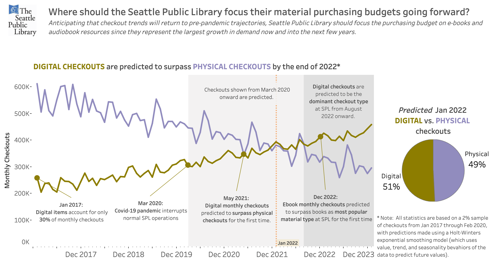

# My Portfolio

---

### [Identify Butterfly Species From Images](https://github.com/RyanBGoebel/ButterflyImagesClassification)

--- 

### [Baking Soad Use Case Analysis From User Generated Content](https://github.com/RyanBGoebel/BakingSodaUseCases)

 

     
---

### [Dashboard to Analyze Digital vs. Physical Checkouts](https://github.com/RyanBGoebel/SPLdashboards)

---

### [Product Improvement Opportunities from E-Commerce Reviews](https://github.com/RyanBGoebel/LLBeanReviews)

---

Page template forked from <a href="https://github.com/evanca/quick-portfolio">evanca</a>

<!-- Remove above link if you don't want to attibute -->
